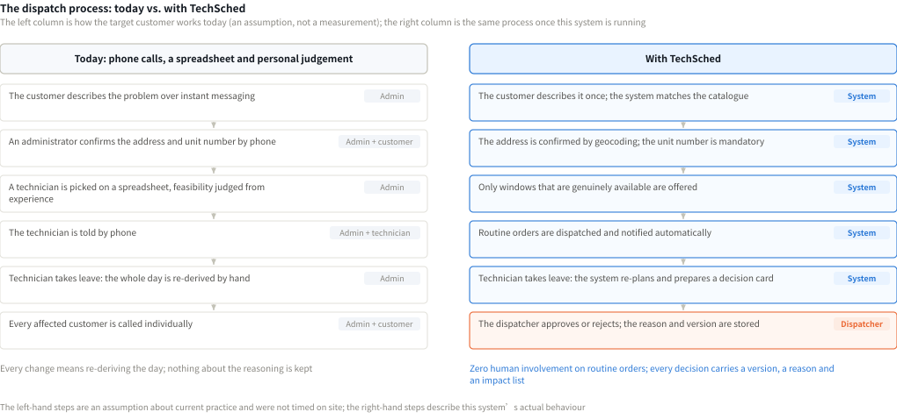
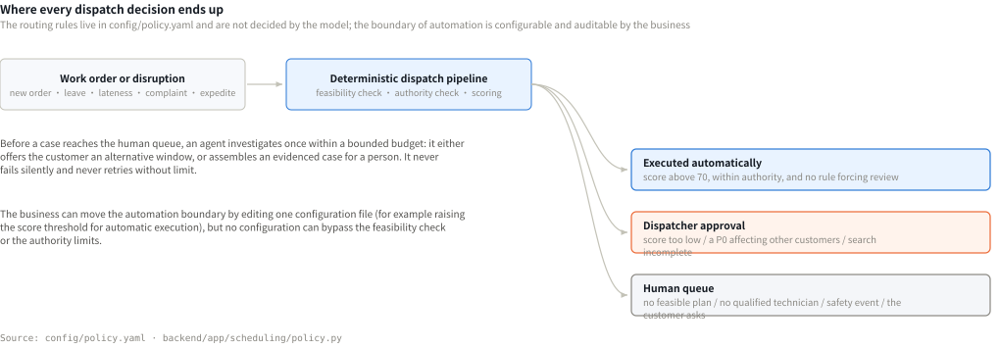
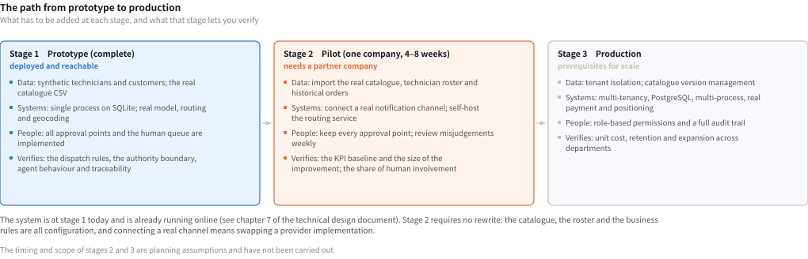

# TechSched Business Proposal

| Item | Value |
|---|---|
| Product | TechSched — intelligent dispatch for on-site repair |
| Business thesis | TechSched helps small and medium on-site repair companies that have no dedicated dispatch team turn scattered customer requests and sudden disruptions into service plans that are executable, low-disturbance and traceable |
| Team / team code | *(to be filled in)* |
| Code repository | https://github.com/yuyuchen0204/techsched-hackathon |
| Live system | https://byyyc.com/techsched/ |
| Companion document | `docs/TechSched-Technical-Design.pdf` (architecture, agent workflows, algorithms, security, deployment, evaluation) |
| Submission date | *(to be filled in)* |

> **How numbers are labelled.** Three kinds appear in this document. **[measured]** comes from the evaluations and tests in the code repository and can be reproduced. **[source]** is cited from public authoritative material; the links are in Appendix A. **[assumed]** is our estimate of the target customer's operations or of future investment; it is unvalidated and stated explicitly so each input can be checked and replaced.
>
> Technical implementation detail is not repeated here; it lives in the technical design document.

## Contents

| Chapter | Title |
|---|---|
| 1 | Executive Summary |
| 2 | Problem & Opportunity |
| 3 | Stakeholders |
| 4 | Solution |
| 5 | Before vs. After |
| 6 | Business Value |
| 7 | Impact & Outcomes |
| 8 | Market Opportunity & Positioning |
| 9 | Business Model |
| 10 | Go-to-Market |
| 11 | Feasibility, Risks & Governance |
| 12 | Scalability, Roadmap & Ask |
| A | Sources |
| B | Cost Estimates |
| C | Data Appendix |

---

# 1. Executive Summary

**The problem we solve.** Small and medium repair companies in Singapore typically schedule with phone calls, instant messaging and spreadsheets. When an urgent order arrives, a technician calls in sick or a visit overruns, somebody has to re-derive the whole day by hand — which is slow, and makes it hard to tell which customers an adjustment will affect.

**Who faces it.** Local repair companies with 5–20 technicians, 15–40 jobs a day, covering two or more trades, where dispatch is a side duty of the owner or an administrator. These micro-enterprises are the overwhelming majority in Singapore: of the 356,600 SMEs with fewer than 200 workers in 2024, **94.7% (337,700) have fewer than 25 workers** [source 1].

**What TechSched provides.** A customer app, a dispatch console and a technician app that connect booking, scheduling, disruption recovery and field execution. Routine work is handled automatically; a high-risk change is shown to the dispatcher with its full impact before it executes; and when the system cannot handle a situation it hands the case to a person together with the actions it already attempted, rather than failing silently.

**The business value.** Less manual coordination, better handling of urgent jobs, protection of existing customer appointments, and a record that makes every scheduling change traceable and explainable.

**How far it has got.** The prototype completes the three-end loop across customer, dispatcher and technician, and is **deployed and reachable** (https://byyyc.com/techsched/ ), running a real model, a real road network and real address resolution. Offline evaluation shows urgent events left unserved falling from 6/10 to 3/10, with **zero** hard-constraint or authority violations in committed plans under either strategy [measured].

**What we are asking for.** A pilot partner with a real field-service team, for 8–12 weeks, to validate improvements in handling time, on-time rate and manual workload. The one-off investment for a pilot is about **S$10,500**, with monthly running cost of about **US$132–184** (breakdown in Appendix B).

---

# 2. Problem & Opportunity

## 2.1 Target Customer

- 5–20 repair technicians
- 15–40 jobs a day
- Two or more repair trades
- Dispatch handled as a side duty by the owner, a service agent or an administrator
- Coordination mainly by phone, WhatsApp and spreadsheets

This profile sits in the densest part of Singapore's enterprise structure: 369,500 SMEs against just 1,500 non-SMEs [source 2], and within the SMEs nearly 95% have fewer than 25 workers [source 1].

## 2.2 The Current Process

Customer describes the problem → the service agent confirms address and time over several exchanges → the dispatcher checks technician schedules by hand → the technician is contacted by phone or message → after a disruption everything is re-coordinated → affected customers are notified again

## 2.3 Three Core Problems

1. **Whether a schedule is executable cannot be confirmed in advance.** Skill, customer time window, technician shift and travel time all have to be judged simultaneously by a person, and mistakes usually surface only after the technician has set off. That judgement is particularly error-prone in Singapore: addresses must be precise to the unit, about eight in ten residents live in public housing, and an address takes the form `Blk 125 Tampines St 11 #05-123` — without the unit number the technician cannot get in [source 3].
2. **Sudden changes have no clear boundary.** To handle one urgent job the dispatcher may need to move several existing appointments, with no quick way to judge the scope or the cost of doing so.
3. **Decisions depend on individual experience and cannot be reviewed.** Why a job was re-assigned, who it affected and what the alternatives were is rarely recorded.

## 2.4 Why It Is Worth Solving

- Technicians are limited and expensive service capacity
- Delays and rescheduling directly affect satisfaction and repeat business
- Manual coordination caps the number of jobs a company can take
- Dispatch errors lead to wasted trips, overtime, complaints and compensation
- As the company grows, experience-based dispatch cannot be replicated

Singapore's geography makes cross-area recovery genuinely practical: the land area is about 744.3 square kilometres [source 4] and the drive between major housing estates is usually under half an hour, so re-assigning another technician to rescue an urgent job normally costs less than failing to honour it. That is the geographic precondition for this product.

---

# 3. Stakeholders

| Role | Current pain point | Desired outcome |
|---|---|---|
| Reporting customer | Repeating the problem, a vague arrival window, opaque expedite effects | Report once, a definite window, live progress |
| Dispatch coordinator | Repeatedly checking the spreadsheet, coordinating by phone, unable to assess knock-on effects | Get an executable plan quickly and only handle the decisions that matter |
| Field technician | Incomplete addresses, sudden task changes, scattered route and rest arrangements | A clear route for the day, job details and an order of operations |
| Company management | No data on efficiency, on-time rate or human involvement | Measurable operating efficiency and service quality |

---

# 4. Solution

## 4.1 Core Value Proposition

> TechSched does not merely send the nearest technician; it finds the next step that is executable, low-disturbance and explainable in the middle of a disruption.

Each of those three words maps to a concrete mechanism: **executable** means skill, time window, shift and travel are re-checked by a validator independent of the solver; **low-disturbance** means each priority has an explicit cap on which orders it may move and how many; **explainable** means every decision carries a score, an affected list and a line-by-line diff.

## 4.2 The Three-End Loop

- **Customer app**: the customer submits a repair request in natural language, confirms the address, the arrival window and contact details, and tracks progress.
- **Dispatch console**: the dispatcher sees the day's schedule, orders at risk and pending events; for any adjustment that would affect an existing appointment, they compare the impact before approving.
- **Technician app**: the technician sees the day's route and the current job, reports departure, arrival, start and completion in turn, and submits a service report or declares unavailability.

## 4.3 Four Key Business Scenarios

### Scenario 1: A routine booking — scheduled without affecting any other order

<figure class="fig fig-narrow">

<figcaption>Scenario 1　The customer app. The system asks for one missing item at a time: problem → address and unit → urgency → time window → contact. Each window button states the technician and earliest arrival, and only slots that are genuinely available without disturbing other orders are shown. The last message is the booking receipt.</figcaption>
</figure>

Several details on this screen answer the three problems in 2.3 directly: the unit number is mandatory and the system refuses to create the order without it; the time window is not free text but an option the system has already trialled; and the customer describes the problem once — if a person becomes involved later, the conversation summary travels with the case.

### Scenario 2: An urgent job — the system finds the earliest executable arrangement and states exactly which existing appointments must move

<figure class="fig fig-panel">

<figcaption>Scenario 2　The review card on the dispatch console. It carries everything the dispatcher needs: the target order and its priority, decision score 74.35 (the automatic threshold is 70), 1 of 5 affected (movable priorities P2 and P3), a line-by-line diff (wo_012 re-assigned from tech_04 to tech_08), and approve / reject / recompute.</figcaption>
</figure>

This is the biggest difference from an automatic scheduling tool: the system does **not** move other customers' appointments just because the score came out high. Whenever an urgent job needs to move another customer, dispatcher approval is mandatory regardless of the score [measured]. The cost is listed explicitly rather than buried in the result.

### Scenario 3: A technician suddenly takes leave — undeparted jobs enter recovery; a departed job keeps its real execution record and goes to a person

<figure class="fig fig-narrow">

<figcaption>Scenario 3　The leave form in the technician app. On submission, undeparted orders are released immediately and graded by the time remaining to their deadline (under 30 minutes becomes the highest priority). An order where the technician has already arrived or started is not released automatically — they are inside the customer's home and a replacement would need that context, so the decision goes to a person.</figcaption>
</figure>

### Scenario 4: The customer needs a person — the conversation and the information already collected travel with the case

<figure class="fig fig-panel">

<figcaption>Scenario 4　The human queue on the dispatch console. Cases are colour-coded by their three sources (customer request / policy requirement / agent escalation) and carry the conversation summary and everything already collected. The dispatcher takes the case and replies, and the reply appears immediately in the customer app; the customer never has to describe the problem again.</figcaption>
</figure>

---

# 5. Before vs. After

| Business step | Before | With TechSched |
|---|---|---|
| Customer books | Several rounds of calls or messages | One conversation collects everything |
| Address confirmation | The block or unit number is easily missed | Confirmed before the order is created; no unit, no order |
| Scheduling | Check the spreadsheet by hand, then call the technician | An executable plan is produced |
| Urgent insertion | The dispatcher re-derives the whole day | Candidate plans are shown with their full impact |
| Technician leave | Call customers and technicians one by one | Affected jobs are identified and recovery starts |
| High-risk decision | Rests on individual experience | The dispatcher approves after seeing the impact |
| Execution feedback | Phone calls or chat messages | State syncs to the console in real time |
| Post-hoc review | No complete record | The reason for a change and its outcome can be read back |

<figure class="fig fig-chart">

<figcaption>Figure 1　The same process under both ways of working. In the right-hand column only the last step keeps a person — and that step is approve or reject, not re-derive.</figcaption>
</figure>

---

# 6. Business Value

## Productivity

- Less repeated communication between service agents, dispatchers and technicians
- The dispatcher's job shifts from "rearrange the whole day" to "review the decisions that matter"
- Less manual coordination time per job
- The same headcount handles more jobs

## Service

- A vague arrival window becomes a definite one ("09:30–11:00, expected at 10:33")
- The customer stops repeating the problem
- Customers are notified proactively when their order changes, and told their original window is still honoured
- Before a paid expedite, the real consequence is stated: how many normal jobs will move, and whether dispatcher confirmation is needed

## Risk

- Fewer skill mismatches, missed arrival times and wrong re-assignments
- Jobs already departed or in progress are protected
- Human approval is retained for high-risk changes
- No silent failure when the system cannot cope

## Scale

- Dispatch quality stops depending on one senior employee
- Job volume can grow without a proportional increase in dispatch staff
- Service rules become a repeatable business process (concentrated in one configuration file)
- A common basis for multi-branch and multi-region operation

## Revenue

- More revenue opportunity from higher job-taking capacity
- Value-added revenue from a transparent expedite service
- Better repeat business and retention from a more consistent experience
- Less revenue lost to lateness, cancellation and mis-assignment

---

# 7. Impact & Outcomes

**This chapter keeps "prototype results already verified" strictly separate from "future pilot targets".**

## 7.1 Evidence From the Prototype

These results come from offline comparisons in a synthetic-data environment and **must not be read as real-company ROI**. The baseline is nearest feasible insertion (zero disturbance, fully validated, shortest inbound travel; no repair, no scoring, no policy engine); both share the same initial schedule, event sequence and clock.

| Metric | Baseline | TechSched prototype | Observation |
|---|---:|---:|---|
| Assignment rate | 57.4% | 63.9% | Up 6.5 percentage points |
| Urgent events left unserved | 6 / 10 | 3 / 10 | Down 50% |
| Hard violations in committed plans | 0 | 0 | Held at 0 |
| Existing orders affected | 0 | 6 | The visible cost of faster urgent response |
| Added travel time | 1,006 min | 1,121 min | A trade-off between responsiveness and travel cost |
| Solve time (mean / max) | 0 / 0 ms | 0.9 / 33 ms | Against a 3–5 s budget; performance is not the constraint |

<figure class="fig fig-chart">

<figcaption>Figure 2　Results of the prototype's offline comparison. Each of the four panels covers one measure and labels its values directly. Data source: data/evaluation/latest.json, reproducible with POST /api/evaluations.</figcaption>
</figure>

Further verified facts [measured]:

- Under a real model, five tasks handling unplaceable orders each used 4–5 tool calls and all ended in an evidenced human case — **no loops, no exhausted budgets, no degradation**.
- 128 backend tests and 42 three-end end-to-end assertions all pass.
- The deployment is reachable and runs a real model, a real road network (OSRM) and real address resolution (OneMap).

## 7.2 KPIs to Validate in a Company Pilot

| KPI | Definition | Baseline | Pilot target |
|---|---|---|---|
| Mean dispatch time | From order confirmation to an executable plan | Measured before the pilot | ≥ 40% below baseline |
| Human involvement rate | Manually re-assigned orders ÷ total orders | Measured before the pilot | Down ≥ 30% |
| On-time arrival rate | Arrivals within the promised window ÷ completed orders | Measured before the pilot | Up ≥ 15 percentage points |
| First-dispatch success rate | Orders needing no second re-assignment ÷ total dispatched | Measured before the pilot | ≥ 90% |
| Technician productive utilisation | Service and travel time ÷ available time | Measured before the pilot | Up ≥ 10 percentage points |
| Urgent response time | From expedite request to confirmed plan | Measured before the pilot | ≤ 5 minutes |
| Reschedule or cancellation rate | Orders rescheduled or cancelled due to dispatch ÷ total | Measured before the pilot | Down ≥ 25% |
| Customer satisfaction | Post-service CSAT or share of satisfied orders | Measured before the pilot | Up ≥ 10% |
| Orders managed per dispatcher per day | Daily orders ÷ dispatchers on shift | Measured before the pilot | Up ≥ 25% |

These are set targets for pilot acceptance, **not results already achieved**.

## 7.3 KPI Principles

- Every business claim must have a corresponding metric
- Synthetic data is never described as real business gains
- The company baseline is measured before the pilot starts
- The capabilities shown in the demo must match the claims in this proposal

---

# 8. Market Opportunity & Positioning

## 8.1 Market Opportunity

- Field-service companies must manage customer time, technician skill and geographic routing at once
- SMEs rarely have a dedicated dispatch team: of Singapore's 369,500 SMEs, nearly 95% have fewer than 25 workers and can hardly support a dedicated dispatch role [sources 1, 2]
- Singapore's density makes cross-area recovery practical: the land area is about 744.3 square kilometres [source 4]
- Multi-trade repair companies need systematic skill matching more than single-trade ones
- Customers keep asking for a definite arrival time and live status: about eight in ten residents live in public housing, where the uniform address structure and mandatory unit number make a door-precise service promise both necessary and achievable [source 3]
- Field-service management software is a growing segment: the global market is expected to grow from US$5.66 billion in 2025 to **US$6.26 billion in 2026** and reach US$9.87 billion by 2031, a compound annual growth rate of **9.54%** over 2026–2031 [source 5]

## 8.2 Competing Alternatives

| Alternative | Main strength | Main limitation |
|---|---|---|
| Manual dispatch + Excel / phone | Cheap and familiar | Depends on individual experience; struggles with disruption; no review possible |
| General ticketing or CRM system | Mature job records and customer management | Does not handle skill, time window, routing or knock-on effects |
| Traditional FSM / rostering software | Complete features, standardised processes | Heavy configuration and high price; a high bar for SMEs |
| **TechSched** | Disruption handling, low-disturbance plans, a three-end loop | ROI and fit still to be validated in a company pilot |

## 8.3 Positioning

> An intelligent dispatch and operational recovery platform for small and medium field-service companies.

Unlike ticketing systems that record the job and rostering tools that produce a static timetable, TechSched focuses on **what to do when things change after the schedule is set** — the step where the target customer spends the most labour and has the fewest tools.

---

# 9. Business Model

This part is a business hypothesis to be validated through customer interviews and the pilot.

## 9.1 Proposed Model: B2B SaaS Subscription

- Per active technician per month (primary model)
- Per service branch per month
- A base subscription plus tiered pricing by job volume
- Integration, implementation and training charged separately
- Advanced analytics, multi-region dispatch and management reporting as add-on modules

## 9.2 Questions to Validate

- How much labour does the company spend each month on dispatch and service coordination?
- What does one delay, re-assignment or customer cancellation cost?
- Would the company rather pay by technician count, job volume or branch count?
- What pilot price is acceptable?
- Which value most drives purchase — labour saved, fewer complaints, more capacity, or better punctuality?

## 9.3 Unit Economics

Pricing will be set after the pilot, but **the cost side can be worked out now**, because every dependency has a published price. For a customer with 10 technicians and 650 jobs a month:

| Cost item | Specification | Monthly cost | Source |
|---|---|---:|---|
| Model calls | Claude Sonnet 4.5 ($3 / $15 per million tokens) | US$78 | [source 6] |
| Model calls (switched to Haiku 4.5) | $1 / $5 per million tokens | US$26 | [source 6] |
| SMS notifications | One key notification per job, US$0.0591 each | US$38 | [source 7] |
| **Marginal cost per customer** | | **US$64 – 116** | |

At an [assumed] subscription of US$20 per technician per month, a 10-technician customer yields US$200 a month, for a **gross margin of about 42–68%** (before allocating fixed platform cost).

One conclusion here has a direct bearing on pricing: **SMS, not the model, is the largest marginal cost.** Scheduling itself makes no model calls — the model is used only for conversation and complaint classification — so model cost grows with the number of conversations, not with job volume or schedule complexity. Moving notifications from SMS to in-app or WhatsApp channels cuts the marginal cost per customer to US$26–78.

The full calculation and fixed costs are in **Appendix B**.

## 9.4 Revenue Model Placeholders

| Item | Value |
|---|---|
| Target number of customers | [to be filled after the pilot] |
| Average monthly revenue per customer | [to be filled after the pilot; the model uses an assumed US$200] |
| Customer acquisition cost | [to be filled after the pilot] |
| Customer implementation cost | About S$10,500 one-off (breakdown in Appendix B) |
| Gross margin target | ≥ 60% (reached by optimising the notification channel) |
| Break-even customer count | [depends on acquisition cost and team size; to be filled after the pilot] |

---

# 10. Go-to-Market

## 10.1 Phase 1: Design Partners

- Local repair companies with 5–20 technicians
- Companies operating two or more repair trades
- Companies currently dispatching through WhatsApp and spreadsheets
- Companies that regularly handle urgent jobs or sudden technician changes

## 10.2 Phase 2: An 8–12 Week Small Pilot

1. Record the current process and the KPI baseline
2. Choose one service area or one dispatch team
3. **Run in recommendation mode first, without changing the real schedule**
4. Validate recommendation quality and staff acceptance
5. Then gradually open routine jobs to automatic handling
6. Decide on wider use based on the KPIs

Step 3 is deliberate. Every approval point stays in place during the pilot, and dispatchers first check whether the system's recommendations match their own judgement; automatic execution is opened only once that trust exists. It also lowers the business risk of the pilot — the worst case is that a dispatcher looked at one extra screen.

## 10.3 Phase 3: Commercial Roll-out

- Acquire customers through property-management and repair-industry partners
- Integrate with existing ticketing systems
- Build quantified sales material from pilot cases
- Expand from a single branch to multiple branches and regions
- Reduce implementation cost through standard configuration

---

# 11. Feasibility, Risks & Governance

## 11.1 Conditions for Deployment

| Condition | What the company provides | Effort |
|---|---|---|
| Service catalogue with standard durations | Trade, specific problem, complexity, standard duration | Compiled once; 46 entries already cover 10 trades |
| Technician skill and shift profiles | Each technician's trades, levels and shift | Entered once, updated on staff changes |
| Existing bookings and service areas | Jobs in progress today, service coverage | Imported once |
| Which adjustments may execute automatically | The automatic score threshold and what each priority may move | One configuration file, decided by the company |
| A named dispatcher for high-risk items | One accountable person | — |
| Customer notification and escalation flow | Notification channel and escalation contacts | Channel integration |

The service catalogue is the only hard prerequisite: **without it the system refuses to create orders rather than falling back to invented durations** [measured]. That is both a product constraint and a value to the company — standard job times are the basis for quoting and performance review.

## 11.2 Main Risks and Responses

| Main risk | Potential impact | Response |
|---|---|---|
| A dispatch recommendation cannot be executed | Delays, re-assignment and complaints | Skill, window, shift and travel are validated before dispatch; human veto allowed [measured: a validator independent of the solver] |
| A sudden change affects existing bookings | Knock-on rescheduling, lower satisfaction | Show the scope of impact and alternatives; high-impact changes require human approval |
| Technician status is not updated in time | The schedule drifts from reality; duplicate dispatch | Key-step confirmation in the technician app; overdue reminders and human checks |
| Customer or address information is incomplete | Wasted trips or unfulfillable jobs | Mandatory checks before submission; exceptions go to the human queue automatically |
| Staff do not adopt the new process | Phone and spreadsheet persist; benefits never materialise | Small pilot with training; human control retained and replaced gradually (see 10.2 step 3) |
| Data security and privacy | Leakage of customer and staff data; compliance risk | Least privilege, access audit, retention rules and necessary masking |
| System or external service outage | Dispatch stalls; response delays | Fall back to manual mode; model and routing failures degrade automatically and are labelled in the interface [measured] |
| The pilot misses its targets | Hard to renew or scale | Set the baseline and KPIs before the pilot; review in stages and adjust scope |

## 11.3 The Boundary of Human Responsibility

- Routine, low-risk work is handled automatically wherever possible
- Major adjustments that affect existing customer bookings are confirmed by the dispatcher
- Jobs already departed or in progress are never silently modified by the system
- Situations the system cannot handle are explicitly handed to a person
- The dispatcher always keeps final control

<figure class="fig fig-chart">

<figcaption>Figure 3　The three destinations of a dispatch decision and the conditions that send it to each. The routing rules live in one configuration file; the company can move the automation boundary (for example by raising the automatic score threshold), but no configuration can bypass the feasibility check or the authority limits.</figcaption>
</figure>

---

# 12. Scalability, Roadmap & Ask

Each stage is estimated as a one-off engineering investment plus a monthly running cost. Engineering effort is counted in person-months at an [assumed] rate of S$6,000 per person-month; a company can substitute its own cost, and industry salary levels can be looked up in MOM's *Occupational Wages* tables [source 8]. Cloud, model and messaging costs all use published vendor prices [sources 6, 7, 9].

<figure class="fig fig-chart">

<figcaption>Figure 4　What has to be added at each of the three stages, and what each stage lets you verify. The system is at stage 1 today and already running online.</figcaption>
</figure>

## 12.1 Prototype → Pilot

| Work item | Engineering effort | Notes |
|---|---:|---|
| Research the real company's process | 0.5 person-months | Including the KPI baseline method |
| Import the service catalogue and technician profiles | 0.25 person-months | Together with the customer |
| Shadow-test on real orders | 0.25 person-months | Recommendation mode; the real schedule is untouched |
| Establish the KPI baseline (including token metering) | 0.25 person-months | — |
| Support the single-area pilot | 0.5 person-months | Spread over 8–12 weeks |
| **Total** | **About 1.75 person-months ≈ S$10,500** | |

Monthly running cost (one customer, 650 jobs a month): **about US$132–184**; see Appendix B.1.

## 12.2 Pilot → Production

| Work item | Engineering effort |
|---|---:|
| Connect real notification and payment flows | 1.5 person-months |
| Add live technician location and traffic | 1.5 person-months |
| Complete identity, permissions and audit | 2 person-months |
| Multi-tenancy and data isolation | 3 person-months |
| Migrate to PostgreSQL and multi-process deployment | 1.5 person-months |
| Connect to the company's ticketing, CRM or ERP systems | 3 person-months |
| Establish operational support and service levels | 1 person-month |
| **Total** | **About 13.5 person-months ≈ S$81,000** |

Fixed monthly platform cost (serving about 20 customers): **about US$248**, with a marginal cost of **US$64–116 per customer**; see Appendix B.2.

## 12.3 Production → Scale

| Work item | Engineering effort |
|---|---:|
| Multi-region and multi-day bookings | 3 person-months |
| More repair trades and catalogue versioning | 1.5 person-months |
| Multi-tenant enterprise service (billing, quotas, self-service configuration) | 2 person-months |
| Management analytics and capacity forecasting | 2 person-months |
| Extension into property management, facilities maintenance and after-sales service | 1.5 person-months (adaptation) |
| **Total** | **About 10 person-months ≈ S$60,000** |

**Engineering investment across the three stages totals about 25.25 person-months, roughly S$151,500** (at the assumed rate). This excludes sales, marketing and overhead.

## 12.4 What We Are Asking For

We are looking for a pilot partner with a real field-service team, to validate together whether TechSched shortens disruption-handling time, reduces manual coordination and improves on-time service.

The demand on the company is light: provide the service catalogue and technician profiles, name one accountable dispatcher, and allow the system to run alongside in recommendation mode for 8–12 weeks. During the pilot the system does not change the real schedule until the company itself is satisfied with the quality of its recommendations.

## 12.5 Closing

> **Every disruption has a better next step.**
> TechSched keeps booking, dispatch and field execution in step.
> Start with the next job.

---

# Appendix A: Sources

All links were checked as reachable on 27 September 2026.

| # | Content | Source |
|---|---|---|
| 1 | In 2024 Singapore had 356,600 SMEs with fewer than 200 workers, of which 337,700 (94.7%) had fewer than 25 workers | Ministry of Manpower, *Written Answer to PQ on Distribution of SMEs*, 3 March 2026. <https://www.mom.gov.sg/newsroom/parliament-questions-and-replies/2026/0303-written-answer-to-pq-on-distribution-of-smes> |
| 2 | In 2025 Singapore had 369,500 SMEs and 1,500 non-SMEs; an SME is defined as operating revenue not above S$100 million or employment not above 200 | Singapore Department of Statistics, *Enterprise Landscape By SMEs And Non-SMEs* dataset, data.gov.sg. <https://data.gov.sg/datasets/d_f9c93c1ffcefe660272c101cd733711c/view> |
| 3 | HDB flats are home to almost 8 in 10 of Singapore's resident population; about 3.18 million citizens and permanent residents lived in HDB flats in 2023, across about 1.1 million households | Housing & Development Board, *Sample Household Survey 2023/24* (HDB Pulse, 26 November 2025). <https://www.hdb.gov.sg/hdb-pulse/news/2025/sample-household-survey-2023-24> |
| 4 | As at December 2025 Singapore's land area was about 744.3 square kilometres | Singapore Land Authority, *Total Land Area of Singapore* dataset, data.gov.sg. <https://data.gov.sg/datasets/d_f74e5ee9575e98ba439bee67e8f9b097/view> |
| 5 | Global field-service management market: US$5.66 billion in 2025, US$6.26 billion in 2026, US$9.87 billion by 2031; CAGR 9.54% over 2026–2031 | Mordor Intelligence, *Field Service Management (FSM) Market Size & Share Analysis - Growth Trends and Forecast (2026 - 2031)*. <https://www.mordorintelligence.com/industry-reports/field-service-management-market> |
| 6 | Claude API pricing: Sonnet 4.5 at US$3 input / US$15 output per million tokens; Haiku 4.5 at US$1 / US$5 | Anthropic official pricing documentation. <https://platform.claude.com/docs/en/docs/about-claude/pricing> |
| 7 | Outbound SMS to Singapore at US$0.0591 per message | Twilio, Singapore SMS pricing. <https://www.twilio.com/en-us/sms/pricing/sg> |
| 8 | Occupation-level wage reference (to replace this document's labour-rate assumption) | Ministry of Manpower, *Occupational Wages 2025*. <https://stats.mom.gov.sg/Pages/Occupational-Wages-Tables2025.aspx> ; resident median income dataset at <https://data.gov.sg/datasets/d_9cd9c40f22a4e45cac8f8b9d895fd5ce/view> |
| 9 | AWS Lightsail instance and managed-database pricing | Amazon Web Services. <https://aws.amazon.com/lightsail/pricing/> |
| 10 | Singapore address and postal-code resolution (free account) | Singapore Land Authority, OneMap. <https://www.onemap.gov.sg/apidocs/register> |

Conclusions marked [measured] come from the code repository and can be reproduced with `scripts/run_tests.sh` and `POST /api/evaluations`.

---

# Appendix B: Cost Estimates

## B.1 Monthly Running Cost During the Pilot (one customer, 10 technicians, 650 jobs a month)

| Cost item | Specification | Unit price | Monthly cost | Source |
|---|---|---|---:|---|
| Application server | Lightsail Linux 4 GB / 2 vCPU / 80 GB SSD | US$24/month | US$24 | [source 9] |
| Self-hosted OSRM routing | Lightsail Linux 8 GB / 2 vCPU / 160 GB SSD | US$44/month | US$44 | [source 9] |
| Database | SQLite on the application host during the pilot | — | US$0 | — |
| Address resolution | OneMap free account | Free | US$0 | [source 10] |
| Model calls | See B.3 | — | US$26 – 78 | [source 6] |
| SMS notifications | One key notification per job = 650 messages | US$0.0591 each | US$38 | [source 7] |
| **Total** | | | **US$132 – 184** | |

## B.2 Monthly Cost in Production (multi-tenant, estimated for 20 customers)

| Cost item | Specification | Monthly cost | Source |
|---|---|---:|---|
| Application server | Lightsail Linux 16 GB / 4 vCPU / 320 GB SSD | US$84 | [source 9] |
| Managed PostgreSQL (high availability) | Lightsail managed database 4 GB standard at US$60; high availability is double the standard price | US$120 | [source 9] |
| Self-hosted OSRM | Lightsail Linux 8 GB | US$44 | [source 9] |
| **Fixed platform cost** | | **US$248** | |
| Marginal cost per customer | Model US$26–78 + SMS US$38 | US$64 – 116 | [sources 6, 7] |
| **Total for 20 customers** | US$248 + 20 × (US$64–116) | **US$1,528 – 2,568** | |
| **Per customer** | | **US$76 – 128** | |

## B.3 Model Cost Calculation

| Input | Value | Source |
|---|---|---|
| Model calls per job's conversation | 8 | [assumed]; replaced by measurement in week 1 of the pilot |
| Input / output tokens per call | 3,000 / 400 | [assumed] |
| Tokens per job | 24,000 input + 3,200 output | Derived |
| Claude Sonnet 4.5 price | US$3 / US$15 per million tokens | [source 6] |
| → cost per job | 0.072 + 0.048 = **US$0.12** | Derived |
| Claude Haiku 4.5 price | US$1 / US$5 per million tokens | [source 6] |
| → cost per job | 0.024 + 0.016 = **US$0.04** | Derived |
| 650 jobs a month | US$26 (Haiku) – US$78 (Sonnet) | Derived |

**The key conclusion**: scheduling itself makes no model calls (it is done by deterministic code); the model is used only for conversation and complaint classification. Model cost therefore grows with the **number of conversations**, not with job volume or schedule complexity — more complex jobs actually spread the unit cost thinner.

## B.4 One-off Engineering Investment

| Stage | Person-months | Amount (at an [assumed] S$6,000 per person-month) |
|---|---:|---:|
| Prototype → Pilot | 1.75 | S$10,500 |
| Pilot → Production | 13.5 | S$81,000 |
| Production → Scale | 10 | S$60,000 |
| **Total** | **25.25** | **S$151,500** |

The labour rate is an assumption; a company can recompute with MOM's occupation-level wage tables [source 8]. Amounts exclude sales, marketing and overhead.

---

# Appendix C: Data Appendix

## C.1 Composition of the Repair Catalogue

The system has a single source of business reference data: the repair catalogue CSV (46 records across 10 trades). Trade, problem, complexity and repair duration all come from that file; the model plays no part in producing those values.

<figure class="fig fig-chart">

<figcaption>Figure C-1　The repair catalogue by trade and by complexity. Complexity and the fixed repair duration map one-to-one in the current catalogue; a technician qualifies only when their skill level is at least the problem complexity.</figcaption>
</figure>

## C.2 Technician Skill Matrix

<figure class="fig fig-chart">

<figcaption>Figure C-2　The skill matrix of the demonstration scenario (8 technicians × 10 trades). The matrix is sparse; the gas-stove trade has exactly one qualified technician in this scenario — when that technician becomes unavailable, those orders have no zero-disturbance recovery and must go through recovery or the human queue. That is precisely the kind of situation this product exists to handle.</figcaption>
</figure>

## C.3 Where the Other Supporting Material Lives

| Material | Location |
|---|---|
| Full default work orders and technician roster | Technical design document appendix / repository `data/scenarios/main.json` |
| Full repair catalogue (46 records) | Repository `data/reference/repair_object_problem_database.csv` |
| Complete feature list | Technical design document, chapters 1–5 |
| Detailed test cases | Technical design document, chapter 8 / repository `backend/tests/` |
| Prototype evaluation method | Technical design document, 8.1 |
| Product interface screenshots | Chapter 4 of this document / repository `data/evaluation/screenshots/` |
| Data and privacy principles | Technical design document, chapter 6 |
| Market data sources | Appendix A of this document |
| KPI definitions | Section 7.2 of this document |
| Pilot implementation plan | Section 10.2 of this document |
| Financial estimates | Appendix B of this document |

---

*Submitted together with `docs/TechSched-Technical-Design.pdf`.*
