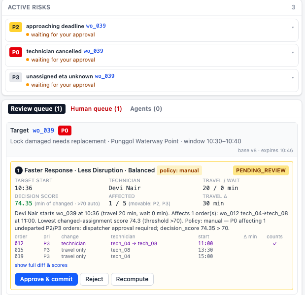
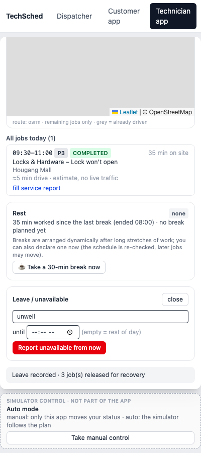
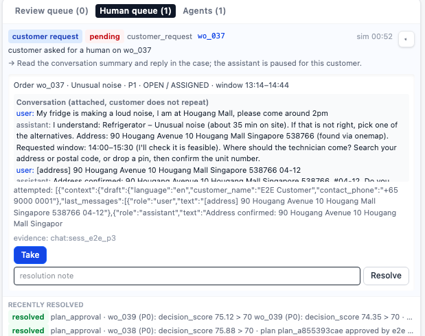
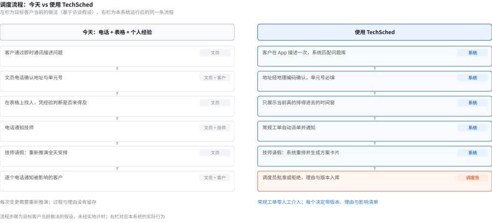
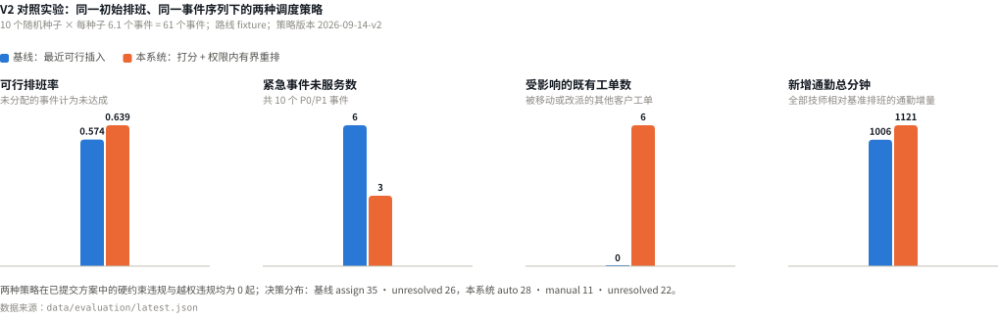
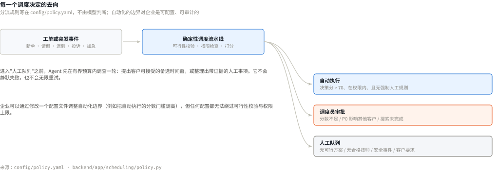
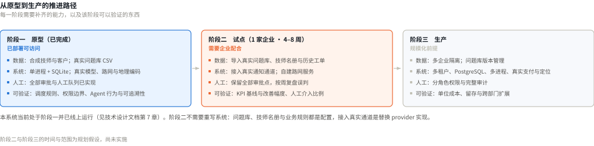
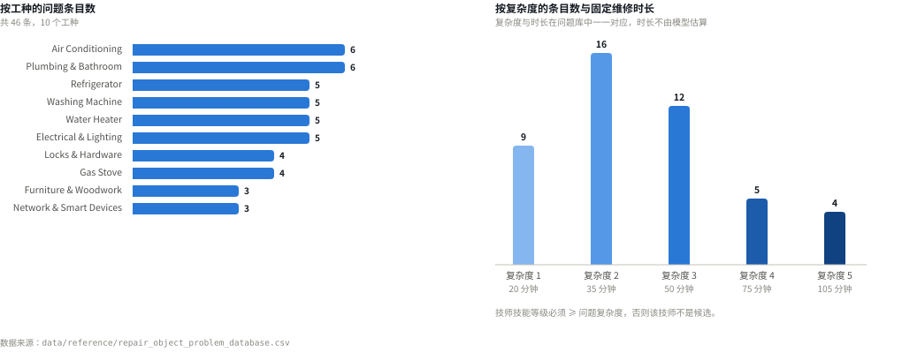
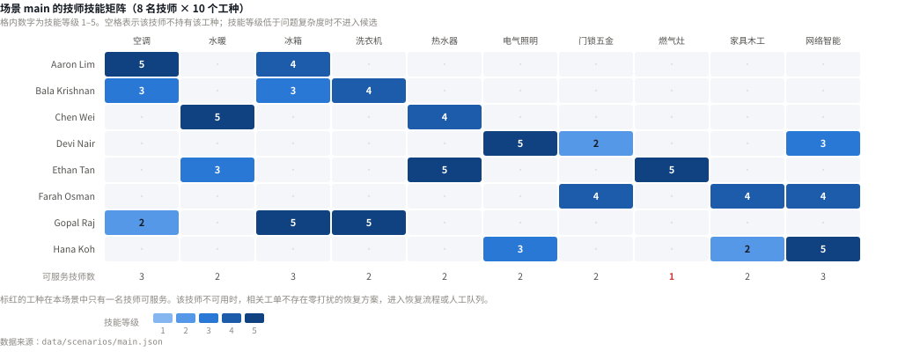

# TechSched Business Proposal

| 项目 | 内容 |
|---|---|
| 产品名称 | TechSched — 上门维修智能调度 |
| 商业主线 | TechSched 帮助缺少专职调度团队的中小型上门维修企业，把分散的客户报修和突发变更转化为可执行、低扰动、可追踪的服务计划 |
| 团队 / 队伍编号 | *（待填写）* |
| 代码仓库 | https://github.com/yuyuchen0204/techsched-hackathon |
| 线上系统 | https://byyyc.com/techsched/ |
| 配套文档 | `docs/TechSched-技术设计文档.pdf`（架构、Agent 工作流、算法、安全、部署、评测） |
| 提交日期 | *（待填写）* |

> **数据标注约定。** 本文的数字分三类：**[实测]** 来自代码仓库中的评测与测试，可复现；**[来源]** 引自公开权威资料，链接见附录 A；**[假设]** 是我们对目标客户经营情况或未来投入的估计，尚未验证，列出是为了让测算可被逐项检验和替换。
>
> 技术实现细节不在本文重复，全部在技术设计文档中。

## 目录

| 章节 | 标题 |
|---|---|
| 1 | Executive Summary 执行摘要 |
| 2 | Problem & Opportunity 问题与机会 |
| 3 | Stakeholders 利益相关者 |
| 4 | Solution 产品方案 |
| 5 | Before vs. After 业务流程对比 |
| 6 | Business Value 商业价值 |
| 7 | Impact & Outcomes 影响与成果 |
| 8 | Market Opportunity & Positioning 市场机会与定位 |
| 9 | Business Model 商业模式假设 |
| 10 | Go-to-Market 市场进入策略 |
| 11 | Feasibility, Risks & Governance 可行性、风险与治理 |
| 12 | Scalability, Roadmap & Ask 扩展计划与合作诉求 |
| A | 信息来源 |
| B | 成本估算明细 |
| C | 数据附录 |

---

# 1. Executive Summary 执行摘要

**我们解决什么问题。** 新加坡中小型维修企业通常依靠电话、即时通讯和电子表格进行排班。当紧急订单、技师请假或服务延误发生时，企业需要人工重新推演全天安排，既耗时，也难以判断调整会影响哪些客户。

**谁面临这个问题。** 拥有 5–20 名技师、每天处理 15–40 张工单、覆盖两个以上维修工种、由店主或文员兼任调度的本地维修企业。这类小微企业在新加坡占绝对多数：2024 年新加坡雇员少于 200 人的中小企业共 356,600 家，其中 **94.7%（337,700 家）雇员少于 25 人** [来源 1]。

**TechSched 提供什么。** 通过客户报修端、调度中控台和技师执行端，把报修、排班、异常恢复与现场执行连接起来。常规任务自动处理；高风险变更向调度员展示完整影响后再执行；系统无法处理时，带着已经尝试过的动作转交人工，不会静默失败。

**能创造什么商业价值。** 减少人工协调、提高紧急工单处理能力、保护既有客户预约，并让每一次调度变更都可以追踪和解释。

**当前完成到什么程度。** 原型已完成客户、调度员和技师三端闭环，并**已线上部署可访问**（https://byyyc.com/techsched/ ），线上运行真实模型、真实路网与真实地址解析。离线评测显示：紧急事件未服务数由 6/10 降至 3/10，且两种策略下已提交方案的硬约束与越权违规数**均为 0** [实测]。

**希望获得什么支持。** 一家拥有真实现场服务团队的试点合作伙伴，用 8–12 周共同验证处理时间、准时率和人工工作量的改善。试点所需的一次性投入约 **S$10,500**，月度运行成本约 **US$132–184**（明细见附录 B）。

---

# 2. Problem & Opportunity 问题与机会

## 2.1 目标客户

- 拥有 5–20 名维修技师
- 日均处理 15–40 张工单
- 覆盖两个或以上维修工种
- 由店主、客服或文员兼任调度
- 主要依靠电话、WhatsApp 和电子表格协调服务

这一画像对应新加坡企业结构中最密集的一段：全国共 369,500 家中小企业，非中小企业仅 1,500 家 [来源 2]；而中小企业中近 95% 雇员少于 25 人 [来源 1]。

## 2.2 当前业务流程

客户描述问题 → 客服反复确认地址和时间 → 调度员人工查看技师安排 → 电话或消息联系技师 → 突发事件发生后重新协调 → 再次通知受影响客户

## 2.3 三个核心问题

1. **排班是否可执行无法提前确认。** 技能、客户时间窗、技师班次和通勤时间需要人工同时判断，错误通常要到技师出发后才暴露。这一判断在新加坡尤其容易出错：地址需精确到单元号，约八成居民居住于组屋，地址形如 `Blk 125 Tampines St 11 #05-123`，缺少单元号技师无法进门 [来源 3]。
2. **突发变更缺少清晰边界。** 为处理一张紧急工单，调度员可能需要移动多张已有预约，但无法快速判断影响范围和代价。
3. **决策依赖个人经验且无法复盘。** 为什么改派、影响了谁、当时还有什么选择，往往没有完整记录。

## 2.4 为什么值得解决

- 技师是有限且昂贵的服务产能
- 延误和改期直接影响客户满意度与复购
- 人工协调限制企业可承接的工单数量
- 调度错误可能导致空跑、加班、投诉与赔偿
- 企业规模扩大后，经验式调度难以复制

新加坡的地理条件使"跨区域恢复调度"具备现实可行性：国土面积约 744.3 平方公里 [来源 4]，主要组屋区之间通常在半小时车程内，因此为救一张急单而改派另一名技师，代价通常低于让这张单无法履约。这是本产品成立的地理前提。

---

# 3. Stakeholders 利益相关者

| 角色 | 当前痛点 | 期望结果 |
|---|---|---|
| 报修客户 | 重复描述问题、到访时间模糊、加急效果不透明 | 一次报修、明确时段、实时进度 |
| 调度协调员 | 反复查看表格、电话协调、难以评估连带影响 | 快速获得可执行方案，只处理关键决策 |
| 维修技师 | 地址不完整、任务变化突然、路线和休息安排分散 | 清晰的当天路线、任务资料与操作顺序 |
| 企业管理者 | 缺少效率、准时率和人工介入数据 | 可衡量的运营效率与服务质量 |

---

# 4. Solution 产品方案

## 4.1 核心价值主张

> TechSched 不只是派出最近的技师，而是在突发变化中找到可执行、低扰动、可解释的下一步。

这一主张的三个词都对应系统中的具体机制：**可执行**指技能、时间窗、班次与通勤由独立校验器复查；**低扰动**指每个优先级能移动的工单类型与数量有显式上限；**可解释**指每个决定都带决策分、受影响清单与逐行差异。

## 4.2 三端业务闭环

- **客户端**：客户通过自然语言提交维修需求，完成地址、上门时段和联系方式确认，并跟踪订单进度。
- **调度中控台**：调度员查看当天排班、风险工单和待处理事件；对于会影响现有预约的调整，可以比较影响后再批准。
- **技师端**：技师查看当天路线和当前任务，依次上报出发、到达、开工和完成状态，并提交服务报告或申报不可用。

## 4.3 四个关键业务场景

### 场景一：常规报修 —— 客户提交需求后，在不影响其他订单的情况下完成排班

<figure class="fig fig-narrow">

<figcaption>场景一　客户端。系统一次只问一个缺失项：问题 → 地址与单元号 → 是否加急 → 时间窗 → 联系方式。时间窗按钮直接写明技师与最早可到时间，且只展示"当前确实排得进去且不打扰其他订单"的选项。最后一条是建单回执。</figcaption>
</figure>

界面上几个细节对应了 2.3 的三个问题：单元号是必填项，缺失时系统拒绝建单；时间窗不是让客户随便填，而是系统试算后给出的可行选项；客户描述一次即可，后续人工介入时对话摘要随事项一起传递，无需重述。

### 场景二：紧急工单 —— 系统寻找最早可执行的安排，并明确展示需要调整的现有预约

<figure class="fig fig-panel">

<figcaption>场景二　调度中控台的审批卡片。卡片上是调度员做决定所需的全部信息：目标工单与优先级、决策分 74.35（自动执行门槛 70）、影响 1/5（可移动的优先级为 P2、P3）、逐行差异表（wo_012 由 tech_04 改派 tech_08），以及批准 / 拒绝 / 重算。</figcaption>
</figure>

这里是产品与"自动排班工具"最大的区别：系统**不会**因为算出的分数高就自动动别人的预约。只要一张紧急工单需要移动其他客户，无论分数多高都必须调度员批准 [实测]。代价被显式列出来，而不是藏在结果里。

### 场景三：技师突然请假 —— 未出发任务进入恢复安排；已出发任务保留真实执行记录并交由人工处理

<figure class="fig fig-narrow">

<figcaption>场景三　技师端的请假表单。提交后，未出发的工单立即释放并按距离截止的剩余时间分级恢复（不足 30 分钟升为最高优先级）；已到达或正在施工的工单不自动释放——技师已在客户家中，换人需要现场上下文，该决定交给人。</figcaption>
</figure>

### 场景四：客户需要人工帮助 —— 客户对话和已收集信息随事项进入人工队列

<figure class="fig fig-panel">

<figcaption>场景四　调度中控台的人工队列。事项按三种来源着色（客户主动要求 / 策略规定必须人工 / Agent 主动升级），并带着对话摘要与已收集的信息。调度员接管后回复，回复实时出现在客户端；客户不需要重新描述问题。</figcaption>
</figure>

---

# 5. Before vs. After 业务流程对比

| 业务环节 | 使用前 | 使用 TechSched 后 |
|---|---|---|
| 客户报修 | 多轮电话或消息确认 | 一次对话完成信息收集 |
| 地址确认 | 容易遗漏门牌或单元号 | 创建订单前完成确认，缺失不建单 |
| 排班 | 人工查看表格并联系技师 | 生成可执行安排 |
| 紧急插单 | 调度员重新推演全天计划 | 展示候选方案及完整影响 |
| 技师请假 | 逐一联系客户与技师 | 识别受影响任务并启动恢复 |
| 高风险决定 | 依赖个人经验 | 调度员在了解影响后批准 |
| 执行反馈 | 依靠电话或聊天消息 | 状态实时同步至中控台 |
| 事后复盘 | 缺少完整记录 | 可以查看变更原因和执行结果 |

<figure class="fig fig-chart">

<figcaption>图 1　同一条流程在两种做法下的对比。右栏中只有最后一步保留了人，而且是"批准或拒绝"，不是"重新推演"。</figcaption>
</figure>

---

# 6. Business Value 商业价值

## Productivity｜生产效率

- 减少客服、调度员和技师之间的重复沟通
- 将调度员的工作从"重新安排全天计划"转变为"审核关键方案"
- 降低每张工单所需的人工协调时间
- 让同等人员规模处理更多工单

## Service｜客户体验

- 将宽泛的上门时间变为明确的服务时间窗（"09:30–11:00，预计 10:33 到"）
- 减少客户重复描述问题
- 订单变化时主动通知客户，并说明原预约仍被满足
- 在付费加急前说明可能产生的实际影响：会移动几张普通单、是否需要调度员确认

## Risk｜运营风险

- 减少技能不匹配、无法准时到达和错误改派
- 保护已经出发或正在服务的任务
- 对高风险变更保留人工审批
- 避免系统无法处理时静默失败

## Scale｜业务扩展

- 降低调度质量对单个资深员工的依赖
- 支持企业在不同比例增加调度人员的情况下扩大工单量
- 将服务规则沉淀为可以重复执行的业务流程（集中在一个配置文件中）
- 为多门店、多区域运营建立统一管理基础

## Revenue｜潜在收入价值

- 通过更高的工单承接能力增加收入机会
- 通过透明加急服务形成增值收入
- 通过更稳定的服务体验提高复购和客户留存
- 减少因迟到、取消和错误派工造成的收入损失

---

# 7. Impact & Outcomes 影响与成果

**本章把"已经验证的原型结果"与"未来试点目标"严格分开。**

## 7.1 原型阶段已有证据

以下结果来自合成数据环境下的离线对照，**不应表述为真实企业 ROI**。基线为"最近可行插入"（零打扰、完整校验、入站通勤最短，不重排、不打分、不走策略）；两者共享同一初始排班、同一事件序列与同一时钟。

| 指标 | 基线方案 | TechSched 原型 | 观察结果 |
|---|---:|---:|---|
| 可行排班率 | 57.4% | 63.9% | 提高 6.5 个百分点 |
| 未能服务的紧急事件 | 6 / 10 | 3 / 10 | 减少 50% |
| 已提交方案的硬性违规 | 0 | 0 | 保持为 0 |
| 受影响的既有工单 | 0 | 6 | 为提升紧急响应付出的可见代价 |
| 新增通勤时间 | 1,006 分钟 | 1,121 分钟 | 响应能力与通勤成本存在权衡 |
| 求解耗时（均值 / 最大） | 0 / 0 毫秒 | 0.9 / 33 毫秒 | 预算 3–5 秒，性能不是瓶颈 |

<figure class="fig fig-chart">

<figcaption>图 2　原型阶段的离线对照实验结果。四个面板分别对应一个量纲，各自独立标注数值；数据来源为 data/evaluation/latest.json，可用 POST /api/evaluations 复现。</figcaption>
</figure>

补充的已验证事实 [实测]：

- 真实模型驱动下，5 个处理无法安置工单的任务各用 4–5 次工具调用后，全部以带证据的人工事项收尾，**无循环、无预算耗尽、无降级**。
- 128 个后端测试与 42 处三端端到端断言全部通过。
- 线上部署可访问，运行真实模型、真实路网（OSRM）与真实地址解析（OneMap）。

## 7.2 企业试点需要验证的 KPI

| KPI | 计算口径 | 基线 | 试点目标 |
|---|---|---|---|
| 平均调度耗时 | 从工单确认到生成可执行方案 | 试点前测量 | 较基线下降 ≥ 40% |
| 人工介入率 | 手动改派工单 ÷ 总工单 | 试点前测量 | 下降 ≥ 30% |
| 准时到达率 | 承诺时段内到达 ÷ 已完成工单 | 试点前测量 | 提升 ≥ 15 个百分点 |
| 首次派单成功率 | 无需二次改派 ÷ 总派单 | 试点前测量 | ≥ 90% |
| 技师有效工时利用率 | 服务与行程时长 ÷ 可用工时 | 试点前测量 | 提升 ≥ 10 个百分点 |
| 紧急工单响应时间 | 从加急提交到确认方案 | 试点前测量 | ≤ 5 分钟 |
| 改期或取消率 | 因调度改期或取消 ÷ 总工单 | 试点前测量 | 下降 ≥ 25% |
| 客户满意度 | 服务后 CSAT 或满意订单占比 | 试点前测量 | 提升 ≥ 10% |
| 调度员日均管理工单量 | 日工单量 ÷ 当班调度员数 | 试点前测量 | 提升 ≥ 25% |

上述目标为设定值，用于试点验收，**不是当前已达成的结果**。

## 7.3 KPI 原则

- 每一个商业主张必须有对应指标
- 不把合成数据描述成真实业务收益
- 试点开始前先测量企业基线
- Demo 中展示的能力应与 BP 中的主张一致

---

# 8. Market Opportunity & Positioning 市场机会与定位

## 8.1 市场机会

- 现场服务企业需要同时管理客户时间、技师技能和地理路线
- 中小企业往往没有专职调度团队：新加坡 369,500 家中小企业里，近 95% 雇员少于 25 人，很难供养专职调度岗 [来源 1、2]
- 新加坡地理密度较高，跨区域恢复调度具备实际可能性：国土面积约 744.3 平方公里 [来源 4]
- 多工种维修企业比单一工种企业更需要系统化的技能匹配
- 客户对更明确的到访时间和实时状态有持续需求：约八成居民住在组屋，地址结构统一、单元号必需，使"精确到门"的服务承诺既必要也可实现 [来源 3]
- 现场服务管理软件是持续增长的细分市场：全球市场规模预计由 2025 年的 56.6 亿美元增长至 **2026 年的 62.6 亿美元**，2031 年达到 98.7 亿美元，2026–2031 年复合年增长率 **9.54%** [来源 5]

## 8.2 竞争替代方案

| 替代方案 | 主要优势 | 主要局限 |
|---|---|---|
| 人工调度 + Excel/电话 | 成本低、团队熟悉 | 依赖个人经验，难应对突发变化且无法复盘 |
| 通用工单或 CRM 系统 | 工单记录与客户管理成熟 | 不处理技能、时间窗、路线及连带影响 |
| 传统 FSM / 排班软件 | 功能完整、流程标准化 | 配置重、价格高，中小企业门槛较高 |
| **TechSched** | 突发调度、低扰动方案、三端闭环 | 仍需企业试点验证 ROI 与适配边界 |

## 8.3 市场定位

> 面向中小型现场服务企业的智能调度与运营恢复平台。

区别于"把工单记下来"的工单系统和"排一张静态班表"的排班软件，TechSched 的产品重心在**排完之后发生变化时怎么办**——这是目标客户投入人力最多、也最缺工具的环节。

---

# 9. Business Model 商业模式假设

这一部分属于商业假设，需要通过客户访谈和试点验证。

## 9.1 建议模式：B2B SaaS 订阅制

- 按活跃技师人数／月收费（主力模式）
- 按服务网点／月收费
- 基础订阅加工单量阶梯收费
- 企业集成、实施和培训单独收费
- 高级分析、多区域调度和管理报告作为增值模块

## 9.2 需要验证的问题

- 企业目前每月在调度和客服协调上投入多少人力？
- 一次延误、改派或客户取消带来多少损失？
- 企业愿意按照技师数、工单量还是网点数付费？
- 企业能够接受的试点价格是多少？
- 哪项价值最能驱动购买：节省人力、减少投诉、增加容量还是提升准时率？

## 9.3 单位经济测算

定价需在试点后确定。但**成本侧现在就可以算清楚**，因为全部依赖项都有公开定价。以一家 10 名技师、月均 650 张工单的客户为例：

| 成本项 | 规格 | 月成本 | 来源 |
|---|---|---:|---|
| 模型调用 | Claude Sonnet 4.5（$3 / $15 每百万 token） | US$78 | [来源 6] |
| 模型调用（改用 Haiku 4.5） | $1 / $5 每百万 token | US$26 | [来源 6] |
| 短信通知 | 每单 1 条关键通知，US$0.0591/条 | US$38 | [来源 7] |
| **每客户边际成本合计** | | **US$64 – 116** | |

若按 [假设] 每技师每月 US$20 订阅，10 技师客户月收入 US$200，**毛利率约 42%–68%**（不含平台固定成本分摊）。

这里有一个对定价有实际影响的结论：**短信是最大的单项边际成本，而模型不是**。原因是调度本身不调用模型——模型只用于对话与投诉分类，因此成本随对话数增长，不随工单量或排班复杂度增长。把通知从短信改为站内或 WhatsApp 通道，可以把每客户边际成本压到 US$26–78。

完整测算与固定成本见**附录 B**。

## 9.4 收入模型占位

| 项目 | 值 |
|---|---|
| 目标客户数量 | ［试点后填写］ |
| 每客户平均月收入 | ［试点后填写；测算中使用假设值 US$200］ |
| 获客成本 | ［试点后填写］ |
| 客户实施成本 | 约 S$10,500（一次性，明细见附录 B） |
| 毛利率目标 | ≥ 60%（需通过通知通道优化达成） |
| 盈亏平衡客户数 | ［取决于获客成本与团队规模，试点后填写］ |

---

# 10. Go-to-Market 市场进入策略

## 10.1 第一阶段：设计合作伙伴

- 拥有 5–20 名技师的本地维修企业
- 同时经营两个以上维修工种的企业
- 目前依靠 WhatsApp 和电子表格调度的企业
- 经常处理紧急工单或技师临时变动的企业

## 10.2 第二阶段：8–12 周小规模试点

1. 记录现有流程与 KPI 基线
2. 选择一个服务区域或一个调度团队
3. **先运行建议模式，不直接改变真实排班**
4. 验证建议质量和员工接受度
5. 再逐步开放常规任务自动处理
6. 根据 KPI 决定是否扩大使用范围

第 3 步是有意设计的：系统的全部审批点在试点期保留，调度员先看系统的建议与自己的判断是否一致，建立信任之后再开放自动执行。这同时也降低了试点的业务风险——最坏情况是调度员多看了一屏信息。

## 10.3 第三阶段：商业推广

- 通过物业管理和维修行业伙伴获客
- 与现有工单系统合作集成
- 用试点案例建立可量化的销售材料
- 从单一网点扩展至多网点和多区域
- 通过标准化配置降低客户实施成本

---

# 11. Feasibility, Risks & Governance 可行性、风险与治理

## 11.1 业务落地所需条件

| 条件 | 企业需要提供 | 工作量 |
|---|---|---|
| 服务目录及标准服务时长 | 工种、具体问题、复杂度、标准时长 | 一次整理；当前 46 条即可覆盖 10 个工种 |
| 技师技能和工作时段档案 | 每名技师的工种与等级、班次 | 一次录入，人员变动时更新 |
| 现有预约与服务区域信息 | 当日在途工单、服务范围 | 导入一次 |
| 明确哪些调整可以自动执行 | 自动执行的分数门槛、各优先级可移动范围 | 一个配置文件，由企业决定 |
| 指定负责高风险事项的调度人员 | 一名责任人 | — |
| 建立客户通知与异常升级流程 | 通知渠道与升级对象 | 接入通道 |

服务目录是唯一的硬前置：**目录缺失时系统拒绝建单，不会退化成编造的时长**[实测]。这既是产品约束，也是对企业的价值——标准工时本身就是报价与考核的基础。

## 11.2 主要风险与应对

| 主要风险 | 潜在影响 | 应对措施 |
|---|---|---|
| 调度建议不可执行 | 延误、改派与客户投诉 | 派单前校验技能、时间窗、班次与通勤；允许人工否决 [实测：独立于求解器的校验器] |
| 突发变更影响既有预约 | 连带改期、满意度下降 | 展示影响范围和替代方案；高影响变更须人工批准 |
| 技师状态更新不及时 | 排班依据失真、重复派单 | 技师端关键节点确认；超时提醒与人工核验 |
| 客户或地址信息不完整 | 空跑或无法履约 | 提交前必填校验；异常自动进入人工队列 |
| 员工不愿采用新流程 | 继续依赖电话表格，收益难兑现 | 小范围试点与培训；保留人工控制权并渐进替换（见 10.2 第 3 步） |
| 数据安全与隐私 | 客户及员工信息泄露与合规风险 | 最小权限、访问审计、留存规则与必要脱敏 |
| 系统或外部服务中断 | 调度停摆、响应延误 | 降级为人工模式；模型与路网失败时自动降级并在界面标注 [实测] |
| 试点效果未达预期 | 难以续费或规模化 | 试点前设基线和 KPI；分阶段复盘并调整范围 |

## 11.3 人工责任边界

- 日常、低风险任务尽量自动处理
- 会影响已有客户预约的重大调整由调度员确认
- 已出发或正在执行的任务不被系统静默修改
- 无法处理的情况必须明确转交人工
- 调度员始终保留最终控制权

<figure class="fig fig-chart">

<figcaption>图 3　每个调度决定的三种去向及其触发条件。分流规则写在一个配置文件里，企业可以调整自动化边界（例如把自动执行的分数门槛调高），但任何配置都无法绕过可行性校验与权限上限。</figcaption>
</figure>

---

# 12. Scalability, Roadmap & Ask 扩展计划与合作诉求

每一阶段的投入按"一次性工程投入"与"月度运行成本"分别估算。工程投入以人月计，单价采用 [假设] S$6,000/人月；企业可按自身成本替换，行业薪资口径可查 MOM《Occupational Wages》表 [来源 8]。云、模型与通信成本全部采用厂商公开定价 [来源 6、7、9]。

<figure class="fig fig-chart">

<figcaption>图 4　三个阶段各自需要补齐的能力，以及该阶段可以验证的东西。系统目前处于阶段一并已线上运行。</figcaption>
</figure>

## 12.1 Prototype → Pilot

| 工作项 | 工程投入 | 说明 |
|---|---:|---|
| 完成真实企业流程调研 | 0.5 人月 | 含 KPI 基线测量方法设计 |
| 导入企业服务目录与技师档案 | 0.25 人月 | 与客户协同 |
| 接入真实订单进行影子测试 | 0.25 人月 | 建议模式，不改变真实排班 |
| 建立 KPI 基线（含 token 计量埋点） | 0.25 人月 | — |
| 完成单区域试点支持 | 0.5 人月 | 分摊在 8–12 周 |
| **合计** | **约 1.75 人月 ≈ S$10,500** | |

月度运行成本（单客户、650 单/月）：**约 US$132–184**，明细见附录 B.1。

## 12.2 Pilot → Production

| 工作项 | 工程投入 |
|---|---:|
| 接入真实通知和支付流程 | 1.5 人月 |
| 引入实时技师位置和路况 | 1.5 人月 |
| 完善身份、权限与审计 | 2 人月 |
| 多租户与数据隔离 | 3 人月 |
| PostgreSQL 迁移与多进程部署 | 1.5 人月 |
| 与企业现有工单、CRM 或 ERP 系统连接 | 3 人月 |
| 建立运营支持与服务等级 | 1 人月 |
| **合计** | **约 13.5 人月 ≈ S$81,000** |

平台月度固定成本（支撑约 20 家客户）：**约 US$248**，每客户边际成本 **US$64–116**，明细见附录 B.2。

## 12.3 Production → Scale

| 工作项 | 工程投入 |
|---|---:|
| 支持多区域和跨日预约 | 3 人月 |
| 扩展更多维修工种与目录版本管理 | 1.5 人月 |
| 建立多租户企业服务（计费、配额、自助配置） | 2 人月 |
| 提供管理分析与容量预测 | 2 人月 |
| 扩展至物业管理、设施维护和售后服务行业 | 1.5 人月（适配工作） |
| **合计** | **约 10 人月 ≈ S$60,000** |

**三阶段工程投入合计约 25.25 人月，约 S$151,500**（按假设单价）。这不包含销售、市场与管理费用。

## 12.4 当前合作诉求

我们正在寻找拥有真实现场服务团队的试点合作伙伴，共同验证 TechSched 能否缩短异常处理时间、减少人工协调并提高准时服务能力。

试点对企业的要求很轻：提供服务目录与技师档案、指定一名调度责任人、允许在 8–12 周内以建议模式并行运行。试点期间系统不改变真实排班，直到企业自己认可建议质量。

## 12.5 结尾

> **每一次突发，都有更好的下一步。**
> TechSched 让报修、调度与现场执行始终保持一致。
> 现在，就从下一张工单开始。

---

# 附录 A：信息来源

所有链接在 2026 年 9 月 27 日核实可访问。

| 编号 | 内容 | 来源 |
|---|---|---|
| 1 | 2024 年新加坡雇员少于 200 人的中小企业共 356,600 家，其中 337,700 家（94.7%）雇员少于 25 人 | 新加坡人力部（MOM），《Written Answer to PQ on Distribution of SMEs》，2026-03-03。<https://www.mom.gov.sg/newsroom/parliament-questions-and-replies/2026/0303-written-answer-to-pq-on-distribution-of-smes> |
| 2 | 2025 年新加坡中小企业 369,500 家，非中小企业 1,500 家；中小企业定义为营业额不超过 1 亿新元或雇员不超过 200 人 | 新加坡统计局（SingStat），《Enterprise Landscape By SMEs And Non-SMEs》数据集，data.gov.sg。<https://data.gov.sg/datasets/d_f9c93c1ffcefe660272c101cd733711c/view> |
| 3 | 组屋是新加坡"近十分之八"居民的居所；2023 年居住于组屋的公民与永久居民约 318 万人，组屋住户约 110 万户 | 新加坡建屋发展局（HDB），《Sample Household Survey 2023/24》（HDB Pulse，2025-11-26）。<https://www.hdb.gov.sg/hdb-pulse/news/2025/sample-household-survey-2023-24> |
| 4 | 截至 2025 年 12 月，新加坡国土面积约 744.3 平方公里 | 新加坡土地管理局（SLA），《Total Land Area of Singapore》数据集，data.gov.sg。<https://data.gov.sg/datasets/d_f74e5ee9575e98ba439bee67e8f9b097/view> |
| 5 | 全球现场服务管理市场：2025 年 56.6 亿美元，2026 年 62.6 亿美元，2031 年 98.7 亿美元，2026–2031 年 CAGR 9.54% | Mordor Intelligence，《Field Service Management (FSM) Market Size & Share Analysis - Growth Trends and Forecast (2026 - 2031)》。<https://www.mordorintelligence.com/industry-reports/field-service-management-market> |
| 6 | Claude 模型 API 定价：Sonnet 4.5 为每百万 token 输入 US$3 / 输出 US$15；Haiku 4.5 为 US$1 / US$5 | Anthropic 官方定价文档。<https://platform.claude.com/docs/en/docs/about-claude/pricing> |
| 7 | 发送至新加坡的出站短信 US$0.0591/条 | Twilio 新加坡短信定价页。<https://www.twilio.com/en-us/sms/pricing/sg> |
| 8 | 新加坡分职业薪资查询口径（用于替换本文的人力单价假设） | 新加坡人力部，《Occupational Wages 2025》。<https://stats.mom.gov.sg/Pages/Occupational-Wages-Tables2025.aspx> ；全职居民收入中位数数据集见 <https://data.gov.sg/datasets/d_9cd9c40f22a4e45cac8f8b9d895fd5ce/view> |
| 9 | AWS Lightsail 实例与托管数据库定价 | Amazon Web Services。<https://aws.amazon.com/lightsail/pricing/> |
| 10 | 新加坡地址与邮编解析服务（免费账号） | 新加坡土地管理局 OneMap。<https://www.onemap.gov.sg/apidocs/register> |

本文标注 [实测] 的结论来自代码仓库，可用 `scripts/run_tests.sh` 与 `POST /api/evaluations` 复现。

---

# 附录 B：成本估算明细

## B.1 试点阶段月度运行成本（1 家客户，10 名技师，650 单/月）

| 成本项 | 规格 | 单价 | 月成本 | 来源 |
|---|---|---|---:|---|
| 应用服务器 | Lightsail Linux 4 GB / 2 vCPU / 80 GB SSD | US$24/月 | US$24 | [来源 9] |
| 自建 OSRM 路网服务 | Lightsail Linux 8 GB / 2 vCPU / 160 GB SSD | US$44/月 | US$44 | [来源 9] |
| 数据库 | 试点期沿用 SQLite，与应用同机 | — | US$0 | — |
| 地址解析 | OneMap 免费账号 | 免费 | US$0 | [来源 10] |
| 模型调用 | 见 B.3 | — | US$26 – 78 | [来源 6] |
| 短信通知 | 每单 1 条关键通知 = 650 条 | US$0.0591/条 | US$38 | [来源 7] |
| **合计** | | | **US$132 – 184** | |

## B.2 生产阶段月度成本（多租户，按 20 家客户估算）

| 成本项 | 规格 | 月成本 | 来源 |
|---|---|---:|---|
| 应用服务器 | Lightsail Linux 16 GB / 4 vCPU / 320 GB SSD | US$84 | [来源 9] |
| 托管 PostgreSQL（高可用） | Lightsail 托管数据库 4 GB 标准 US$60，高可用为标准价双倍 | US$120 | [来源 9] |
| 自建 OSRM | Lightsail Linux 8 GB | US$44 | [来源 9] |
| **平台固定成本小计** | | **US$248** | |
| 每客户边际成本 | 模型 US$26–78 + 短信 US$38 | US$64 – 116 | [来源 6、7] |
| **20 家客户合计** | US$248 + 20 × (US$64–116) | **US$1,528 – 2,568** | |
| **折合每客户** | | **US$76 – 128** | |

## B.3 模型成本测算

| 输入 | 取值 | 来源 |
|---|---|---|
| 每张工单的对话所需模型调用次数 | 8 次 | [假设]，试点第一周实测替换 |
| 每次调用的输入 / 输出 token | 3,000 / 400 | [假设] |
| 每单合计 token | 24,000 输入 + 3,200 输出 | 推导 |
| Claude Sonnet 4.5 单价 | US$3 / US$15 每百万 token | [来源 6] |
| → 每单成本 | 0.072 + 0.048 = **US$0.12** | 推导 |
| Claude Haiku 4.5 单价 | US$1 / US$5 每百万 token | [来源 6] |
| → 每单成本 | 0.024 + 0.016 = **US$0.04** | 推导 |
| 650 单/月 | US$26（Haiku）– US$78（Sonnet） | 推导 |

**关键结论**：调度本身不调用模型（调度由确定性代码完成），模型只用于对话与投诉分类。因此模型成本随**对话数**增长，不随工单量或排班复杂度增长；工单越复杂，单位成本反而摊薄。

## B.4 一次性工程投入汇总

| 阶段 | 人月 | 金额（按 [假设] S$6,000/人月） |
|---|---:|---:|
| Prototype → Pilot | 1.75 | S$10,500 |
| Pilot → Production | 13.5 | S$81,000 |
| Production → Scale | 10 | S$60,000 |
| **合计** | **25.25** | **S$151,500** |

人力单价为假设值，企业可按 MOM 分职业薪资表 [来源 8] 替换后重算。金额不含销售、市场与管理费用。

---

# 附录 C：数据附录

## C.1 维修问题库构成

系统的业务基准数据只有一个来源：维修问题库 CSV（46 条记录、10 个工种）。工种、问题、复杂度与维修时长均取自该文件，模型不参与这些数值的产生。

<figure class="fig fig-chart">

<figcaption>附图 C-1　维修问题库的工种分布与复杂度分布。复杂度与固定维修时长在当前问题库中一一对应；技师技能等级必须不低于问题复杂度，否则不进入候选。</figcaption>
</figure>

## C.2 技师技能矩阵

<figure class="fig fig-chart">

<figcaption>附图 C-2　演示场景的技师技能矩阵（8 名技师 × 10 个工种）。矩阵稀疏，燃气灶工种在本场景中仅有一名技师可服务——该技师不可用时，相关工单不存在零打扰的恢复方案，必然进入恢复流程或人工队列。这正是本产品要处理的典型情形。</figcaption>
</figure>

## C.3 其他附录材料的位置

| 材料 | 位置 |
|---|---|
| 默认工单与技师名册全表 | 技术设计文档附录 / 仓库 `data/scenarios/main.json` |
| 维修大类及具体问题全表（46 条） | 仓库 `data/reference/repair_object_problem_database.csv` |
| 产品完整功能清单 | 技术设计文档第 1–5 章 |
| 详细测试用例 | 技术设计文档第 8 章 / 仓库 `backend/tests/` |
| 原型评测方法 | 技术设计文档 8.1 |
| 产品界面截图 | 本文第 4 章 / 仓库 `data/evaluation/screenshots/` |
| 数据与隐私原则 | 技术设计文档第 6 章 |
| 市场数据来源 | 本文附录 A |
| KPI 计算口径 | 本文 7.2 |
| 试点实施计划 | 本文 10.2 |
| 财务测算表 | 本文附录 B |

---

*本文与 `docs/TechSched-技术设计文档.pdf` 配套提交。*
